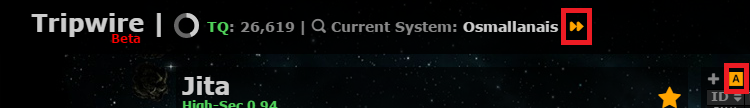

# Tripwire Initial Setup

## Registering

If you don't have a Tripwire account, yet, please register at <https://tripwire.torpedodelivery.com/>. You will need to provide a username, a password and an API key. As with all 3rd party tools, please don't use the same password as your Eve account. It is also recommended that you choose a strong password and that it doesn't match with passwords from other 3rd party tools, for example other Tripwire servers. You can always change your password from `Settings`, in fact it's good practice to change it every once in a while. In case you lose your password, please contact your Tripwire admin. He won't be able to retrieve it for you, but he'll be able to reset it.

The API key isn't stored on Tripwire, it's just a method of proving you are the owner of the account. You can even delete it after creating the account.

There is also the option of signing in with EVE SSO, but only after creating a Tripwire account.

## In-Game Browser (IGB)

Tripwire is able to track your location through the in-game browser only if you've added `https://tripwire.torpedodelivery.com/*` to the *Trusted Sites* list in the browser's options.

You can choose to either use this browser or minimize it and open Tripwire in an external browser (Chrome, Firefox, IE, others). The browsers will automatically synchronize. This is very useful for multiple-monitor setups.

## Tracking and Auto-Mapper

*Tracking* and *Auto-Mapper* options make building wormhole chains easier. This is how you can enable these options:

* **Tracking** - if this option is enabled, Tripwire will be able to follow your in-game location (solar system). It is recommended you enable this option by clicking the `>>` symbol as shown in the screenshot below.
* **Auto-Mapper** - if this option is enabled, Tripwire will automatically connect or link solar systems you visit through wormholes. It is recommended you enable this option by clicking the `[A]` symbol as shown in the screenshot below.

## Masks

A mask is the collection of wormhole connections and signatures the members of that particular mask have added. You can select a mask from `Settings` - the cogwheel icon in the upper-right corner and then `Account Settings`:

Please select our alliance mask named `WiNGSPAN` as shown in the screenshot below:

Click Save after selecting the correct mask.

## What next?

The basic setup is done and now you're ready to use Tripwire. For more information on how to use Tripwire, including advanced features, please visit [Tripwire Tips and Tricks](tripwire_tips.md).
