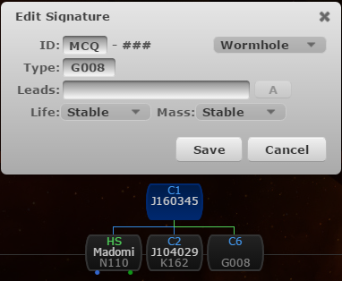

# Tripwire Tips and Tricks

## General Guidelines

It is very important you use Tripwire if you want to get help from your fellow alliance members or help others. Usually you will see a Tripwire link in the fleet MOTD with the destination. Here are some general guidelines you should follow:

* Specify all the information for a wormhole connection: ID, type, destination, lifetime and mass. It will make navigation easier for you and your fellow alliance members.
* Try not to leave the `ID` or the `Type` of a wormhole unknown: `???`. Please explicitly specify both of them on both ends of the connection. This is very important since there are no alliance bookmarks, so it will make scanning easier for others and help will arrive faster.
* Follow the bookmarking conventions (see corporation bulletins for more info).
* If the current system you're in leads to another pilot's chain, please ask that pilot's permission if you want to jump in (that is if you see the pilot online on Tripwire in that chain). It goes without saying that you should ask that pilot's permission if you want to run sites in that system, also :)
* Don't delete other people's signatures or comments on purpose, unless they are not applicable anymore or they expired.

## Copy-pasting Signatures

You don't have to add each signature manually. You can automatically import signatures from the `Probe Scanner` window into Tripwire by selecting all signatures with `Ctrl-A` and then copying them with `Ctrl-C`. After that just paste them into the browser where you have Tripwire open with `Ctrl-V`.

If you made a mistake you can hit the `Undo` button:

After copy-pasting signatures a pop-up will appear. You can click the `delete missing sigs` if you want old signatures to be removed:

Unless it's a wormhole, all signatures have a default life-time of 72 hours. After this time expires, the signatures will automatically be removed by the server. You can manually change the life-time from the drop-down list as shown below:

This may prove useful because signatures may last more than 72 hours if nobody initiates warp to them. If you plan long-term camps this is an option which is worth looking into. You can also change your default signature life-time from settings:

Please don't set the life-time of a signature to infinite unless you know what you are doing.

## Tabs

Tabs can be added from the wormhole chain window by click the plus icon `+`:

There are two types of tabs you can add:

* **K-space tab** - displays all wormhole chains which have a kspace exit, either added by you or your fellow alliance members. You can create a `K-space tab` like this (you can give it any other name):

* **System tab** - displays the wormhole chain which contains the system specified. This is similar to a bookmark and it's useful when you're monitoring multiple systems. You can create a `System tab` like shown below (you can give it any other name). This is also nice if you want to keep the chain displayed without in-game tracking disrupting the view:

## Comments

Comments can be added/edited/deleted from the comment window. These are basically notes on the selected system and it's good practice to leave notes containing intel or any other sort of information you might think will be useful for you or your fellow alliance members. This is how you add comments:

Feel free to change the formatting (text size, color, etc.) if you want to make it more readable. Do not delete comments made by your fellow alliance members unless you are 100% certain the comment is not applicable anymore. In this case it might be better to cross out the text or ~~strikethrough~~ the old notes. If uncertain, just ask.

## Specifying Class without Jumping the K162

It is good practice to specify the signature ID, type, life, mass of a wormhole and where it leads to, even for `K162` wormholes. You can even specify the destination class without jumping the wormhole:

Notice the `Class-3` in the "**Leads**" field. This is useful for `K162` types. Here is a list of generic destinations you can specify:

* High-Sec
* Low-Sec
* Null-Sec
* Class-1
* Class-2
* Class-3
* Class-4
* Class-5
* Class-6

You may ask how you can distinguish between C1, C2 and C3 wormholes and between C4 and C5 wormholes. You can visually identify them by following this guide: [Wormhole Visual Identification](whvisual.md). It takes some practice but you will find it very useful.

## K162 Frigate Holes

Small ship-sized wormholes are symbolized by a green line instead of the classic blue. Only frigates, destroyers and heavy interdictors may jump through. It is essential to be aware of this in case you fly ships which are not allowed to jump through and it is important to mark the connections accordingly in Tripwire.

However, you may find yourself on the `K162` side of a frigate wormhole with no possibility of jumping through. Tripwire does not support marking frigate wormholes explicitly, yet, but there is a workaround.

Simply determine the class the wormhole connection leads to, either by description and/or by [color](whvisual.md), and enter the corresponding code even if it's the `K162` side:

| Class | Code |
|-------|------|
| C1    | E004 |
| C2    | L005 |
| C3    | Z006 |
| C4    | M001 |
| C5    | C008 |
| C6    | G008 |
| C13   | A009 |

This is an example for a frigate wormhole which leads to a Class-6:

## Gate Connections

You can specify gate connections between systems by creating a new signature of the *Wormhole* type, and, instead of a wormhole code, you just write `GATE` instead. Notice from the image below that gate connections are marked as white lines.

Why is this useful? In this case it's helpful to show that *Aphend*, which is only 2 jumps from the destination C1, is connected to *Perimeter* through a C2 wormhole. This makes traveling easier for backup if no other path finding techniques are used.

Please remove `GATE` connections once the operation is over as they have no expiry.

## Occupants

You can see other pilots in the wormhole chain and their ship types and others can see you by hovering the mouse over the small portrait icon. The location is broadcasted only if the pilot has Tripwire in the in-game browser opened.

## Flares

Flares can be added/deleted by right-clicking a system in the wormhole chain window and assigning one of three colors as shown in the screenshot below. You might need to refresh by left-clicking on the selected system to be able to view the flare you added.

There may be some variations, but the most used convention is this:

* **red** - the target system where a battle takes place or will take place (wait for the FC to give you the approval to jump this system)
* **yellow** - the system where the fleet assembles or holds just before jumping the target red system
* **green** - usually a staging system or a secondary fleet operation/battle

Once the operation is over, please remove the flares.

## Mass

You can see what ships have passed through a wormhole connection by right-clicking a system and clicking on the `Mass` option. You have to right-click on a different system than the one you have selected. This will give you info about the pilot, direction, ship, mass and time. Note that the mass is calculated from the ship's base mass and does not include modifiers like plates or prop mods:

## Path Finding

You are able to see at a glance how far the k-space exits in your chain are from a selected system, which in this case is *Jita*. To enable this feature you must first create a new tab for your chain and then enable the icon which looks like an eye: `add viewing system to chain`.

With the system tab selected (underlined by a blue line) and the icon marked as yellow, select a destination. The destination can be selected by switching tabs or by modifying the URL directly: `https://tripwire.torpedodelivery.com/?system=Jita`

Note that only k-space destinations can be selected and Tripwire won't account for possible shortcuts along the way. For a more advanced path finding, please visit [Short Circuit](shortcircuit.md) page.

## Layout and Background

### Layout

You can customize the layout by toggling the Tripwire windows icon in the upper right corner. Once it's highlighted you can drag/move and resize the activity, signature, comments and wormhole chain windows. When you're done, click the icon again to lock or save the changes.

### Background

You can modify the default background for Tripwire by going to `Settings` -> `Preferences`. You will need to provide a link to the image you want set as your new background:

If you prefer the old Tripwire background: <https://tripwire.torpedodelivery.com/images/bg_old.jpg>

Other backgrounds made by our fellow alliance members:

<https://tripwire.torpedodelivery.com/images/bg01.jpg>
<https://tripwire.torpedodelivery.com/images/bg02.jpg>
<https://tripwire.torpedodelivery.com/images/bg03.jpg>
<https://tripwire.torpedodelivery.com/images/bg04.jpg>
<https://tripwire.torpedodelivery.com/images/bg05.jpg>

### What now?

Just go out there, explore and have fun. Now you know how to use Tripwire effectively :)
