# Wormhole Visual Identification

You can determine the destination class of a wormhole based on its color. This is especially useful for "unknown" (C1/C2/C3) or "dangerous" (C4/C5) wormholes where the class can not be determined by description alone. For example, the following descriptions can be found:

* This wormhole seems to lead into Unknown parts of space.
* This wormhole seems to lead into Dangerous Unknown parts of space.
* This wormhole seems to lead into Deadly Unknown parts of space.
* This wormhole seems to lead into High Security parts of space.
* This wormhole seems to lead into Low Security parts of space.
* This wormhole seems to lead into Null Security parts of space.
* This wormhole seems to lead to the unique and mysterious Thera system.

This guide focuses on the first two points and explains how to distinguish between C1, C2 and C3 wormholes and between C4 and C5 wormholes. The first step is to look at the wormhole's center and rotate it until you find the lens or the nebula (this is the most distinct feature of a wormhole). In time you'll get used to it and you'll identify the wormhole at a glance. The aura of the wormhole is a sign of how much mass can pass through it.

## C1
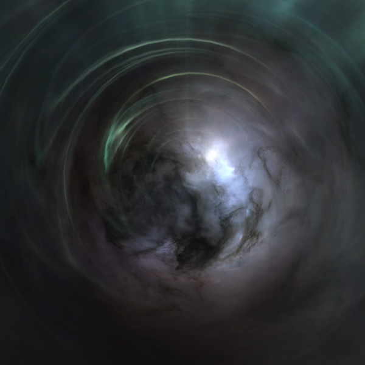

Class 1 wormholes are black and white with no distinct shape. The black and white is modeled together. Another useful information is the mass description: "Up to medium size ships can pass through this wormhole". The mass restriction generates a teal aura around the wormhole.

## C2
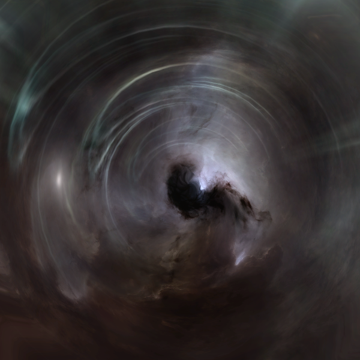

Class 2 wormholes are mostly black and white. Notice the well defined black lens (or nebula) in the center.

## C3
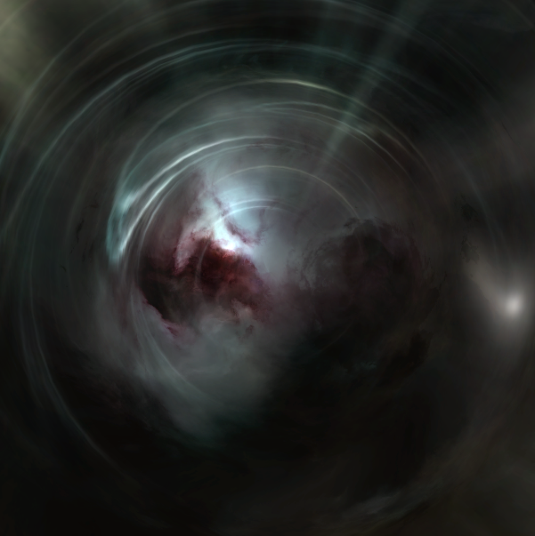

Class 3 wormholes have a distinct red and black center with a white outer ring.

## C4
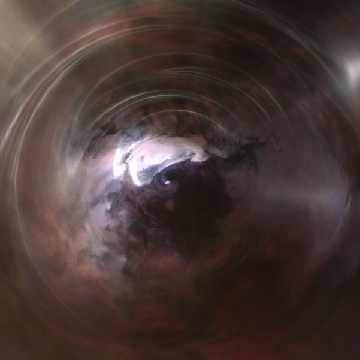

Class 4 wormholes are a murky red, purple and blue with a white wedge and black center.

## C5
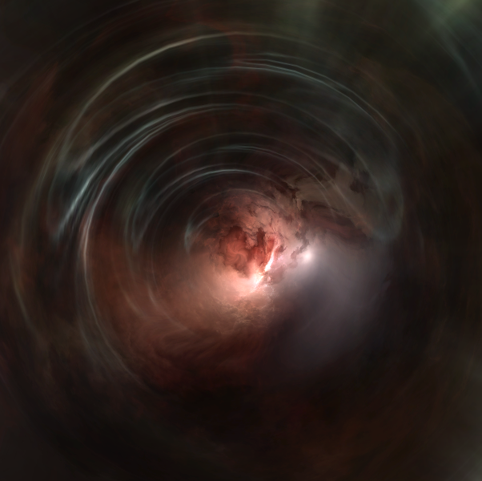

Class 5 wormholes are orange and white with a white wedge through the center.

## C6
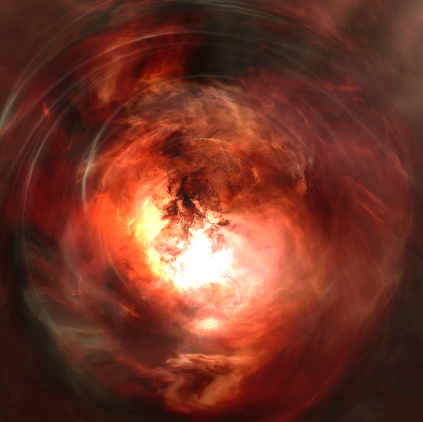

Class 6 will indicate that it leads to "Deadly Unknown" parts of space. C6 wormholes are a bright fiery red color.

## Other: Thera (C12), Tripnulls (C13), Drifter wormholes (C14-C18)
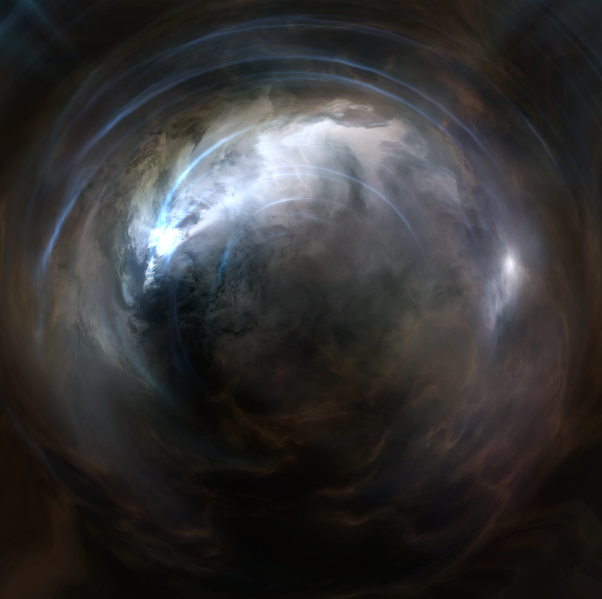

You can also identify Thera, C13 and drifter wormholes in the same way. For Thera wormholes, the description will obviously state that it leads to Thera. A C13 wormhole has also a blue aura which is a sign that it accepts only ships with a small: frigates, destroyers and heavy interdictors with bubbles active.

The center of the wormhole is broken and cloudy with no real definition, similar to a C1, with a touch of brown to it.

## Mass identification

The color of the flare around a wormhole can tell you the size of ships that can go through.

### Small

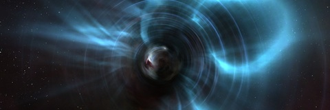

A royal blue aurora indicates wormholes that only allow frigate-mass ships. This is the most important one to recognise, particularly when approaching the K162 side.

### Medium
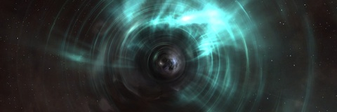

A wormhole with a teal aurora won't allow battleships through (exception is the Nestor), and is the indication of a wormhole connecting to or from class 1 w-space.

### Large
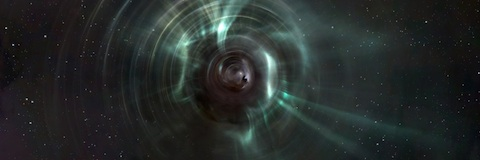

A turquoise aurora highlights a wormhole that allows every ship below capital hulls.

### X-Large
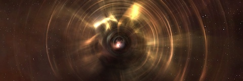

A yellow aurora indicates that capital ships can pass through.

## New Eden wormhole colors

You can also determine the region of space the wormhole connection leads to. However, this out of scope for this article. You can find more info here: <http://www.tigerears.org/2013/09/17/new-eden-wormhole-colours/>

## Useful resources

* Video made by Alebrelle Kuato: [EVE Online Wingspan Wormhole Visual Identification](https://www.youtube.com/watch?v=yUad1Lh8nHY)
* [EveUni Wormhole Classification](http://wiki.eveuniversity.org/Wormholes#Wormhole_Identification)
* [EveUni Wormhole Sizes and Restrictions](http://wiki.eveuniversity.org/Wormholes#Mass)
* <http://www.tigerears.org/2014/09/30/wormhole-colours-2/>
